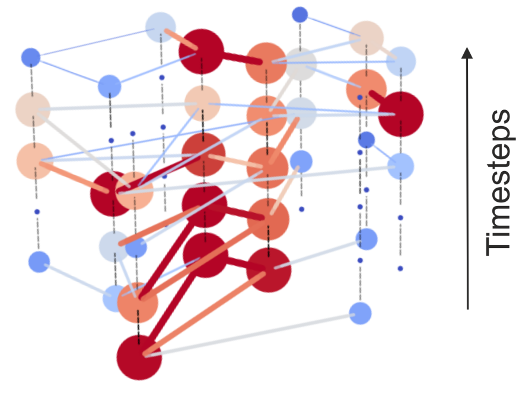
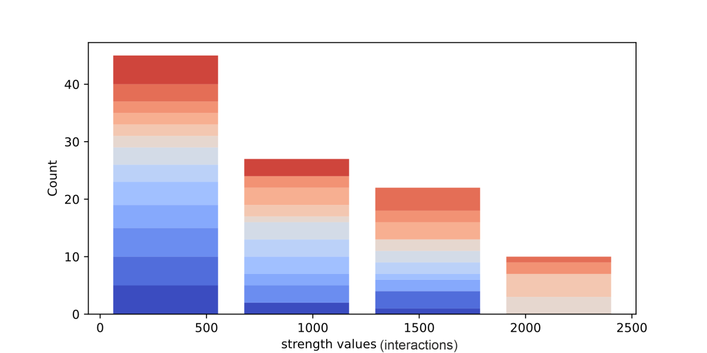

# TempGraphViz
An interactive GUI designed for exploring, analyzing, and visualizing **temporal graphs**.

---
## Installation
TempGraphViz is part of the Python Package Index and can be installed via ```pip install tempnetviz```.

To start the GUI, simply run ```python -m tempgraphviz.main_gui```.
---

## Quickstart
Your data should be stored in a single folder, as **.csv files**. Each .csv file representing a graph at a given time point of the analysis.
Run ```python -m tempnetviz.main_gui```. Then:

1. Click **Open** in the GUI to select the folder containing your `.csv` files.
2. Use the **Sub-graph selector** to choose one or multiple layers to visualize or analyze.
3. Adjust the **metrics** to explore structural properties of your data.
   You can apply a **graph cut** (edge pruning) for better readability on large graphs.
4. Switch between **Graph**, **Histogram**, and **Animation** views to gain different insights.

You can apply aesthetic changes (e.g. edge/nodes widths, colors...) to the results via the [Settings](settings.md) button.


---
## Main Functionalities

### Structure visualization
Once you have selected the input files to be visualized, the default view will be a 3D stack that lets you see how connections evolve as a function of time.
You can also compute various [metrics](metrics.md) that quantify the importance of the nodes in the graph. More important nodes will be displayed larger as others.


### Metrics distribution


### Graph animation


### Temporal layout 


---

## Example on real data


---

