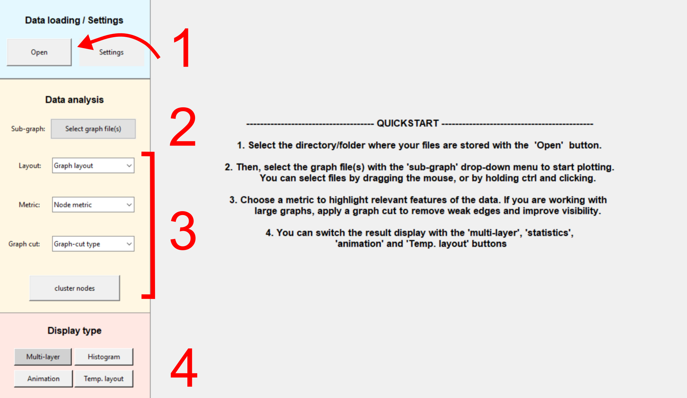

# TempGraphViz
An interactive GUI designed for exploring, analyzing, and visualizing **temporal graphs**.

---
## Installation
TempGraphViz is part of the Python Package Index and can be installed via ```pip install tempnetviz```.

To start the GUI, simply run ```python -m tempgraphviz.main_gui```.
---

## Quickstart
Your data should be stored in a single folder, as **.csv files**. Each .csv file representing a graph at a given time point of the analysis.
Run ```python -m tempnetviz.main_gui```. Then:

1. Click **Open** in the GUI to select the folder containing your `.csv` files.
2. Use the **Sub-graph selector** to choose one or multiple layers to visualize or analyze.
3. Adjust the **metrics** to explore structural properties of your data.
   You can apply a **graph cut** (edge pruning) for better readability on large graphs.
4. Switch between **Graph**, **Histogram**, and **Animation** views to gain different insights.

You can apply aesthetic changes (e.g. edge/nodes widths, colors...) to the results via the [Settings](settings.md) button.




---
## Main Functionalities

### Structure visualization
Once you have selected the input files to be visualized, the default view will be a 3D stack that lets you see how connections evolve as a function of time.
You can also compute various [metrics](metrics.md) that quantify the importance of the nodes in the graph. More important nodes will be displayed larger as others.
In this example, a colormap was also applied via the [settings](settings.md) to make the results more explicit.


### Metrics distribution
Visualize how metrics evolve over time using histograms. By default, the different time steps are stacked on top of each other for easier comparison.
In this example, deep blue corresponds to early times and deep red to the last datapoints. You can also plot each time step side by side by changing the corresponding
option in the [settings](settings.md).


### Graph animation


### Temporal Layout

You can also display the results as a temporal layout. At each timestep, this representation orders the nodes on the y axis to reduce edge-overlap.
In this example, the color and thickness of node a shows its strength value. 


---

## Example on real data


---

